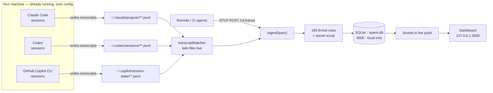
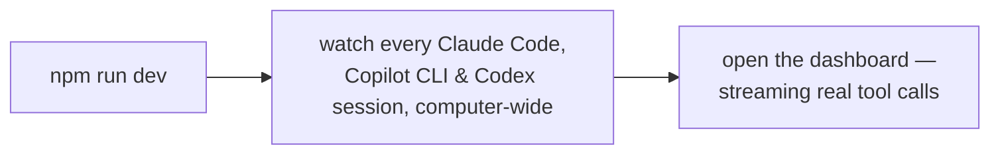
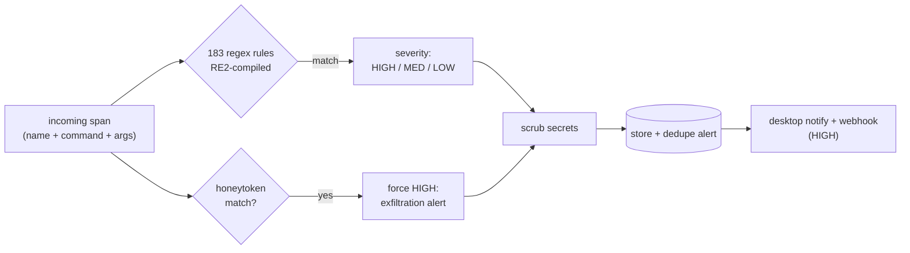
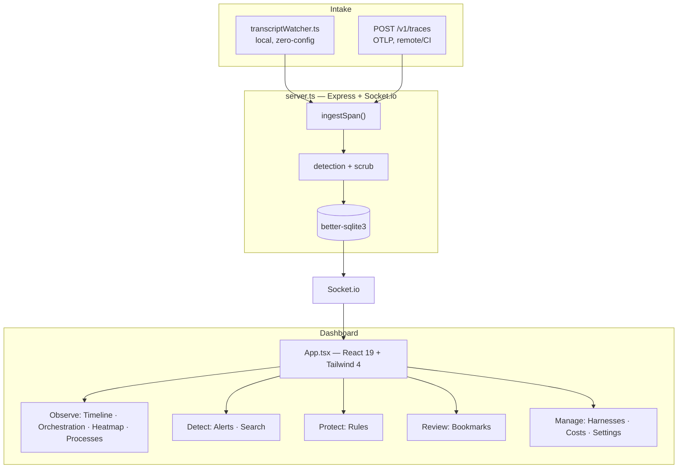

# ClaudeSec

[](https://github.com/aanjaneyasinghdhoni/ClaudeSec/actions/workflows/ci.yml)
[](LICENSE)
[](https://nodejs.org)

**A zero-config, fully-local security observatory for your AI coding agents.**

ClaudeSec watches every Claude Code, GitHub Copilot CLI, and Codex session already running on your machine — across every repo — and surfaces what your agents are actually doing: every tool call, every command, every file touched, scored live against a built-in threat-detection engine. No environment variables. No restarting your terminal. Nothing ever leaves your computer.

---

## Why ClaudeSec

Most agent-observability tools ask you to set five OpenTelemetry environment variables, edit your shell profile, and restart your agent before you see a single span. People don't — so they never get visibility.

ClaudeSec takes a different path. Claude Code, GitHub Copilot CLI, and Codex **already write full session transcripts to disk** as they work. ClaudeSec tails those transcripts in real time, so the moment you install it, it sees everything — including sessions that are already running.



The watcher and the OpenTelemetry endpoint feed the **same** pipeline, so local capture and remote/CI agents land in one dashboard.

---

## Quick Start

ClaudeSec runs entirely from this repository. Clone it, install, and start watching every agent on your machine:

```bash
git clone https://github.com/aanjaneyasinghdhoni/ClaudeSec.git
cd ClaudeSec
npm install
npm run dev          # dashboard at http://localhost:3000
```

Requires Node ≥ 18. No environment variables, no shell edits, no agent restart — the watcher tails your agents' on-disk transcripts the moment any of them does something.



### Run it as a background service (optional)

To keep ClaudeSec running across reboots, install the user-level background service (launchd · systemd · Scheduled Task). Build the dashboard once, then manage it through the bundled CLI:

```bash
npm run build
node cli/init.mjs            # install + start the service, open the dashboard
node cli/init.mjs stop       # stop and remove the service
```

Installing the service also removes any legacy ClaudeSec OTEL environment config — the watcher needs none.

### Platform support

| Platform | Background service | Status |
|---|---|---|
| macOS | launchd LaunchAgent | **Verified** |
| Linux | systemd user service | Experimental |
| Windows | Scheduled Task (at logon) | Experimental |

The watcher and dashboard run anywhere Node ≥ 18 runs; only the auto-start *service* layer is platform-specific. On every platform you can always run the foreground server with `npm run dev`.

---

## Zero-config capture

Once the service is running it captures, with **no further setup**:

- **Real tool names** — `Bash`, `Read`, `Edit`, `Write`, MCP tools, skills — not opaque `tool_call/unknown`.
- **Full command text** — so the detection rules have real input to match.
- **Accurate durations** — each tool call is paired with its result.
- **Model & token usage** — for cost and activity views.
- **Every repo, every session** — including agents that were already running before you installed.
- **Three agents, automatically** — Claude Code (`~/.claude/projects`), GitHub Copilot CLI (`~/.copilot/session-state`), and Codex (`~/.codex/sessions`).

Disable the watcher with `CLAUDESEC_WATCH=0`. Importing historical sessions is opt-in (`CLAUDESEC_BACKFILL=1`); by default only new activity is captured.

---

## Connecting remote or CI agents (OTLP)

The local watcher covers everything on your machine. For agents on **other** machines, in **containers**, or in **CI** — where ClaudeSec can't read the filesystem — the OpenTelemetry endpoint stays available:

```bash
export OTEL_EXPORTER_OTLP_ENDPOINT=http://<host>:3000/v1/traces
export OTEL_EXPORTER_OTLP_PROTOCOL=http/json
```

Both intakes converge on the same detection-and-storage pipeline. Any OTLP/HTTP-JSON-compatible tool works.

---

## Privacy & security

ClaudeSec reads sensitive material (your agents' commands, prompts, and code), so it is built local-first by construction:

- **Loopback only** — the server binds `127.0.0.1` by default. Set `CLAUDESEC_HOST=0.0.0.0` only if you deliberately want LAN access.
- **No egress** — nothing is sent anywhere. The single optional outbound path is `OTEL_FORWARD_URL`, off unless you set it (and SSRF-blocked for private ranges).
- **Owner-only database** — `spans.db` is created with `0600` permissions.
- **Secret scrubbing (on by default)** — known secret shapes (keys, tokens, credentials), home paths, usernames, and emails are redacted before anything is persisted, broadcast, or exported. The attribute *shape* is preserved so downstream collectors keep working. Disable with `CLAUDESEC_DISABLE_SCRUB=1`.
- **Honeytokens** — plant canary strings; any span containing one fires a HIGH-severity `Honeytoken exfiltration` alert.

  ```bash
  export CLAUDESEC_HONEYTOKENS='aws-prod-key-DO-NOT-LEAK,CanaryDB-SensitiveRow-42'
  ```

Scrubbing catches known secret *shapes*; it does not sanitize arbitrary source code or free-form prose. Keep ClaudeSec on a trusted, local machine.

---

## Features

- **Live activity feed & Timeline** — real tool calls streaming in as they happen, with nanosecond-precision durations.
- **Orchestration** — per-agent tool inventory, command-audit trail, and a file-access panel that flags sensitive paths.
- **Heatmap** — tool-usage intensity across harnesses and sessions.
- **Threat detection** — 183 built-in regex rules (HIGH / MEDIUM / LOW) plus honeytoken canaries and behavioral-anomaly checks, evaluated on every span.
- **Alerts** — deduplicated, triageable detection log (dismiss / false-positive) with JSON export.
- **Custom rules** — CRUD UI with a live tester; user patterns compiled with RE2 (linear-time, ReDoS-safe).
- **Cost view** — token usage and API-equivalent cost per session and per model, plus subscription-plan awareness (API / Pro / Max 5× / Max 20×) so flat-rate users see value-vs-plan instead of a misleading bill.
- **Themes** — four built-in themes (Midnight, Carbon, Daylight, Paper), saved locally.
- **Process scanner** — detect running agent CLIs and **kill / pause / resume** them from the dashboard.
- **Webhooks** — push HIGH-severity alerts to Slack, Discord, or any JSON endpoint, with delivery history.
- **Desktop notifications** — native OS alerts for HIGH-severity detections.
- **MCP server** — Model Context Protocol tools at `POST /mcp` for AI-to-AI interaction.
- **Prometheus metrics** — `GET /metrics` for Grafana.
- **OTLP forwarding** — transparent proxy to an upstream collector (`OTEL_FORWARD_URL`).
- **Auto-export** — hourly JSON snapshots to `exports/` (last 24 retained).
- **Bookmarks, tags, annotations, session labels & notes** — organize and review.

---

## Threat detection

Every span is evaluated against the built-in rule engine before storage.



| Severity | Example patterns |
|---|---|
| **HIGH** | Destructive commands, credential reads, piped remote code, SQL destruction, exfiltration, prompt injection, reverse shells, supply-chain attacks, container escape |
| **MEDIUM** | Env-var access, dotenv reads, SSH-key manipulation, sensitive system files, base64 decode, network recon |
| **LOW** | Full table scans, world-executable permissions, sudo usage, global installs, broad globs |

---

## Architecture



**Tech stack:** Express · Socket.io · better-sqlite3 · React 19 · Tailwind CSS 4 · Vite 6 · TypeScript. The watcher uses Node built-ins only — no extra runtime dependencies.

---

## Configuration

All configuration is optional — see `.env.example`. Highlights:

| Var | Default | Purpose |
|---|---|---|
| `CLAUDESEC_PORT` | `3000` | Dashboard + OTLP listen port |
| `CLAUDESEC_HOST` | `127.0.0.1` | Bind address (loopback by default) |
| `CLAUDESEC_WATCH` | `1` | Local transcript watcher (`0` to disable) |
| `CLAUDESEC_BACKFILL` | `0` | Import historical transcripts on first run |
| `CLAUDESEC_DISABLE_SCRUB` | — | Forward raw, unscrubbed attributes |
| `CLAUDESEC_HONEYTOKENS` | — | Comma-separated exfiltration canaries |
| `CLAUDESEC_MAX_SPANS` | `50000` | Count-based retention |
| `CLAUDESEC_RETENTION_DAYS` | `30` | Age-based retention |
| `OTEL_FORWARD_URL` | — | Transparent OTLP proxy target (SSRF-blocked for private ranges) |
| `CLAUDESEC_WEBHOOK_URL` | — | Slack / Discord / generic JSON endpoint |
| `CLAUDESEC_WEBHOOK_THRESHOLD` | `high` | Minimum severity to webhook |

---

## CLI

From this repo, invoke the CLI as `node cli/init.mjs <command>` (the names below are shown without the prefix):

```bash
claudesec                 # install + start the background watcher, open the dashboard
claudesec stop            # stop and remove the background service
claudesec status          # server health, span/session counts, uptime
claudesec open            # open the dashboard in the default browser
claudesec tail            # stream live spans in the terminal (--harness, --severity)
claudesec processes       # list running agent processes
claudesec sessions        # list sessions with health scores (--json)
claudesec top             # rank sessions (--by spans|threats|health)
claudesec search <query>  # full-text span search (--severity, --harness, --limit)
claudesec bookmarks       # view or delete bookmarked spans
claudesec export [file]   # download all spans as JSON
claudesec report [id]     # generate a session security report (Markdown, --out)
claudesec reset           # wipe all spans, sessions, and alerts (with confirmation)
```

---

## Docker

```bash
docker compose up
```

Runs the Express backend and serves the production-built frontend. `spans.db` persists via a mounted volume. (Filesystem-based local watching is most useful on the host; in containers, prefer the OTLP endpoint.)

---

## API & integrations

- **OpenAPI spec:** [`openapi.yaml`](openapi.yaml)
- **Graph export:** `GET /api/graph`, `/api/graph/mermaid`, `/api/graph/dot`
- **Prometheus:** scrape `GET /metrics`
- **MCP:** `POST /mcp`

```yaml
scrape_configs:
  - job_name: claudesec
    static_configs:
      - targets: ['localhost:3000']
    metrics_path: /metrics
```

---

## Contributing

Contributions welcome — see [CONTRIBUTING.md](CONTRIBUTING.md). Run `npm run lint` (TypeScript type-check) before opening a PR.

---

## License

[MIT](LICENSE)
