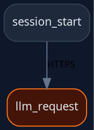

## Overview

The Graph Export API renders the span dependency graph in text-based formats suitable for embedding in documentation, sharing in pull requests, or rendering with external tools. Both Mermaid and Graphviz DOT are supported.

## Endpoints

### GET /api/graph/mermaid

Export the span graph as a Mermaid flowchart.

**Query parameters:**

| Parameter | Type | Description |
|-----------|------|-------------|
| `session` | string | Filter to a specific session traceId (optional) |

```bash
curl "http://localhost:3000/api/graph/mermaid?session=trace-abc-123"
```

**Response:** `Content-Type: text/plain`

```
flowchart TD
    abc123def456["session_start"]
    ghi789jkl012["llm_request"]:::medium
    abc123def456 --> ghi789jkl012
    classDef high   fill:#450a0a,stroke:#ef4444,color:#fca5a5
    classDef medium fill:#431407,stroke:#f97316,color:#fdba74
    classDef low    fill:#422006,stroke:#eab308,color:#fde047
```

Nodes are labeled with the span name (truncated to 60 characters). Threat-severity spans are assigned CSS classes (`high`, `medium`, `low`) with corresponding colors. Non-alphanumeric characters in span IDs are replaced with underscores.

### GET /api/graph/dot

Export the span graph in Graphviz DOT format.

**Query parameters:**

| Parameter | Type | Description |
|-----------|------|-------------|
| `session` | string | Filter to a specific session traceId (optional) |

```bash
curl "http://localhost:3000/api/graph/dot" -o claudesec.dot
```

**Response:** `Content-Type: text/vnd.graphviz` with a download disposition header.



Render the DOT file with Graphviz:

```bash
dot -Tpng claudesec.dot -o claudesec.png
```
