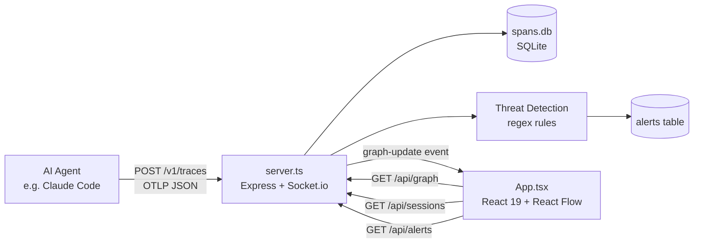

## What is ClaudeSec?

ClaudeSec is a local-first observability dashboard designed for developers who run AI coding agents on their machines. It listens for [OpenTelemetry](https://opentelemetry.io/) (OTLP) traces, persists them in a local SQLite database, evaluates every span against a library of security detection rules, and renders the resulting activity as a live, interactive graph.

Because everything runs locally — Express backend on `localhost:3000`, SQLite on disk — no data ever leaves your machine.

---

## Key Features

<CardGroup cols={2}>
  <Card title="Real-time OTLP ingestion" icon="bolt">
    Accepts standard OTLP/HTTP JSON payloads at `POST /v1/traces`. Any OpenTelemetry-compatible agent works out of the box.
  </Card>
  <Card title="Multi-harness support" icon="grid-2">
    Nine built-in harness profiles for Claude Code, GitHub Copilot, OpenHands, Cursor, Aider, Cline, Goose, Continue.dev, and Windsurf — each with its own color and detection heuristics.
  </Card>
  <Card title="Threat detection" icon="shield-halved">
    30+ built-in regex rules covering prompt injection, secret leakage, destructive shell commands, supply-chain attacks, and more. Add custom rules from the UI without restarting the server.
  </Card>
  <Card title="Interactive graph" icon="diagram-project">
    React Flow canvas shows every span as a node. Color-coded edges and node halos reveal severity at a glance. Zoom, pan, and click any node to inspect attributes.
  </Card>
  <Card title="Timeline view" icon="timeline">
    Gantt-style timeline shows when each span ran relative to others, making it easy to correlate suspicious events with agent actions.
  </Card>
  <Card title="Orchestration view" icon="sitemap">
    Per-harness statistics (span count, threat count, tools used) and cross-harness co-occurrence data for sessions where multiple agents ran simultaneously.
  </Card>
  <Card title="Custom rules" icon="sliders">
    Create, test, and delete regex-based detection rules via the Rules tab in the dashboard or the REST API.
  </Card>
  <Card title="Desktop notifications" icon="bell">
    Browser `Notification` API alerts fire immediately when a high-severity threat is detected, even if the ClaudeSec tab is in the background.
  </Card>
</CardGroup>

---

## Architecture

### Data flow

1. An AI agent emits OTLP/HTTP JSON traces to `http://localhost:3000/v1/traces`.
2. `server.ts` parses each `resourceSpan`, detects which harness produced it, and runs every span's serialized attributes through the security rule engine.
3. Spans are written to `spans.db` (SQLite, persisted across restarts). Any matched rules create an alert row.
4. The server broadcasts a `graph-update` Socket.io event to all connected browser clients.
5. `App.tsx` receives the event, fetches the updated graph from `/api/graph`, and re-renders the React Flow canvas with [Dagre](https://github.com/dagrejs/dagre) layout applied.

---

## Quick Links

<CardGroup cols={2}>
  <Card title="Quick Start" icon="rocket" href="/quickstart">
    Install ClaudeSec, start the server, and connect your first agent in under two minutes.
  </Card>
  <Card title="Claude Code harness" icon="terminal" href="/harnesses/claude-code">
    The most common integration — Anthropic's official CLI agent.
  </Card>
  <Card title="Security rules" icon="shield" href="/security/rules">
    Understand and extend the built-in detection rule library.
  </Card>
  <Card title="API Reference" icon="code" href="/api-reference/introduction">
    Full REST API documentation for all endpoints.
  </Card>
</CardGroup>
